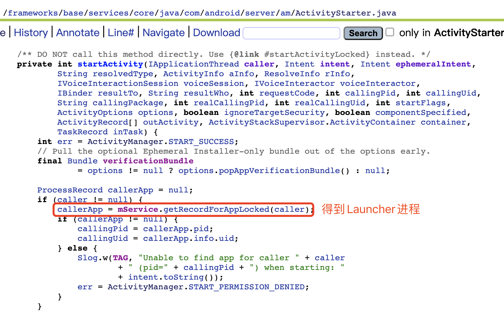
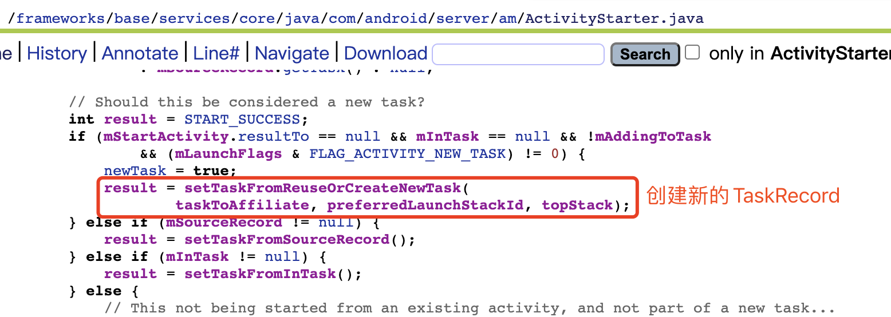

andrioid源码在线地址：http://androidxref.com/

从桌面上启动 APP

android8.0

#####  Launcher 请求 AMS过程

Launcher

​	startActivitySafely 

​		

Activity

​	startActivity

​		

​	startActivityForResult

​		

​			Instrumentation 主要用来监控应用程序和系统的交 互

Instrumentation

​		execStartActivity

​			

​				首先调用 ActivityManager 的 getService 方法来获取 AMS 的代理对象 ，接着调用它的sta11Activity 方法

ActivityManager

​	getService

​		

​			IActivityManagerSingleton是一个 Singleton类。 

​			得到名为“activity”的 Service 引用 ， 也就是 IBinder 类型的 AMS 的引用 ，将它转换成IActivityManager 类型的对象

​			IActivityManager.aidl 的文件路径 为 frameworks/base/core/java/android/app/ IActivityManager.aidl 

​			要 实 现进程间通信，服务器端也就是 AMS 只需要继承 IActivityManager.Stub 类并实现相应的方也就可以了。

​			回 到 Instrumentation 类的 execStartActivity 方法中，从上 面得 知 execStartActivity 方法最 终调用的是 AMS 的 startActivity 方怯 。

#####  AMS到ApplicationThread的调用过程

ActivityManagerService

​	startActivity

​		

​		startActivityAsUser 方法比 startActivity方法多了一个参数 UserHandle.getCallingUserld()，这个方法会获得调用者的Userld, AMS 根据这个UserId来确定调用者的权限。

​		startActivityAsUser

​		

​			先判断调用者进程是否被隔离，如果被隔离则抛出 SecurityException 异常， 再检查调用者是否有权限， 如果没有权限也会抛出 SecurityException 异常 

​			最后 调用了 ActivityStarter 的 startActiviηLocked 方法

​			需要注意的是倒数第二个参数类型为 TaskRecord，代表启动的 Activity所在的枝。最后一个参数” startActivityAsUser"代表启动的理由

ActivityStarter

​	startActivityMayWait

​		

​			

​				

​			ActivityStarter是 Android 7.0 中新加入的类，它是加载 Activity 的控制类 ， 会收集所有 的逻辑来决定如何将 Intent和 Flags转换为 Activity，并将 Activity和 Task以及 Stack相关 联。 ActivityStarter的 startActivityMayWait方法周用了 startActivityLocked 方法

ActivityStarter

​	startActivityLocked

​		

​			紧接着调用了 startActivity 方法

ActivityStarter

​	startActivity

​		

​				

​				

​			在注释 l 处判断 IApplicationThread类型的 caller是否为 null，这个 caller是方法i周用一路传 过来的，指向的是 Launcher所在的应用程序进程的 ApplicationThread对象

​			在注释 2处调 用 AMS 的 getRecordForAppLocked 方法得到的是代表 Launcher 进程的 callerApp 对象，它 是 ProcessRecord类型的，ProcessRecord用于描述一个应用程序进程

​			ActivityRecord 用于描述一个 Activ町，用来记录一个 Activity 的所有信息 。接下来创建 ActivityRecord，用于描述将要启动的 Activity

​			并在注释 3处将创建的 ActivityRecord赋值给 ActivityRecord口 类型的 outActivity，这个 outActivity会作为注释 4处的 startActivity方怯的参数传递下去。

ActivityStater

​	startActivity

​		

​			startActivity方法紧接着调用了 startActivityUnchecked方法

ActivityStater

​	startActivityUnchecked

​		

​			

​			

​				startActivityUnchecked 方法主要处理与枝管理相关的逻辑 

​				在标注1处我们得知， 启动根 Activity 时会将 Intent 的 Flag 设置为 FLAG ACTIVITY NEW TASK，这样注释 l 处的条件判断就会满足

​				接着执行注释 2处的 setTaskFromReuseOrCreateNewTask， 其内部会创建 一 个新的 TaskRecord ，用来描述 一 个 Activity 任务栈，也就是说 setTaskFromReuseOrCreateNewTask方怯内部会创建一个新的 Activity任务栈。

​				在注释3处会调用ActivityStackSupervisor的resumeFocusedStackTopActivityLocked方法

ActivityStackSupervisor

​	resumeFocusedStackTopActivityLocked

​		

​			在注释 1 处调用 ActivityStack 的 topRunningActivityLocked 方法获取要启动的 Activity 所在校的枝顶的不是处于停止状态的 ActivityRecord

​			在注释 2处，如果 ActivityRecord不 为 null，或者要启动 的 Activity 的状 态不是 RESUMED 状 态

​			就 会 调用 注释 3 处的 ActivityStack的resumeTopActivityUncheckedLocked方法

ActivityStack

​	resumeTopActivityUncheckedLocked

​		

​	resumeTopActivityInnerLocked

​		

​		

​			resumeTopActivityInnerLocked 方法代码非常多，我们只需要关注调用了 ActivityStackSupervisor 的 startSpecificActivityLocked 方法即可

ActivityStackSupervisor 

​	startSpecificActivityLocked 

​		

​			在注释 l 处获取即将启动的 Activity 所在的应用程序进程，

​			在注释 2 处判断要启动的 Activity所在的应用程序进程如果已经运行的话，

​			就会调用注释 3 处的 realStartActivityLocked 方战，这个方法的第二个参数是代表要启动的 Activity所在的应用程序进程的 ProcessRecord

​	

​	realStartActivityLocked 

​		

​			

​			

​			这里的 app.thread 指的是IApplicationThread，它的实现是 ActivityThread 的内部类 ApplicationThread，其中 ApplicationThread继承了IApplicationThread.Stub

​			app指的是传入的要启动的 Activity 所在的应用程序进程，因此，这段代码指的就是要在目标应用程序进程启动 Activity。

​			当前代码逻辑运行在 AMS 所在的进程( SystemServer 进程)中，通过 ApplicationThread 来与应用程序进程进行 Binder 通信

​			换句话说， ApplicationThread 是 AMS 所在进程( SystemServer 进程)和应用程序进程的通信桥梁，如图 4-3 所示。

#####  ActivityThread启动Activity的过程

​			接着查看ApplicationThread的scheduleLaunchActivity方法，其中ApplicationThread是 ActivityThread 的内部类，应用程序进程创建后会运行代表主线程的实例 ActivityThread ，它管理 着当前应用程序 进程的 主 线程。

ApplicationThread

​	scheduleLaunchActivity

​		

​			

​			scheduleLaunchActivity 方法将启动 Activity 的参数封装成 ActivityClientRecord,

​			sendMessage方怯向 H 类发送类型为 LAUNCH一ACTIVITY 的消息，并将 ActivityClientRecord 传递过 去

​			sendMessage 有 多个重载方法 ，最终调用的 sendMessage 如下所示:

ActivityThread

​	sendMessage

​		

​			这里 mH 指的是 H，它是 ActivityThread 的内部类并继承 自 Handler，是应用程序进程 中主线程的消息管理类。 因为 ApplicationThread是一个 Binder，它的调用逻辑运行在 Binder 线程池中，所以这里需要用 H 将代码的逻辑切换到主线程中

​		

​			

​		查看 H 的 handleMessage 方怯中对 LAUNCH_ACTIVITY 的处理，

​		在注释 l 处将传过 来的 msg 的成员变 量 obj 转换为 ActivityClientRecord

​		在注释 2 处通过 getPackagelnfoNoCheck 方法获得 LoadedApk 类型的对象并赋值给 ActivityClientRecord 的 成员变量 packagelnfo

​		应用程序进程要启动 Activity时需要将该 Activity所属的 APK加载进 来，而 LoadedApk 就是用来描述己加载的 APK 文件的 。在注释 3 处调用 handleLaunchActivity 

ActivityThread

​	handleLaunchActivity

​		

​			

​			注释 l 处的 performLaunchActivity 用来 启动 Activity ，

​			注释 2 处的代码 用来将 Activity 的状态设置为 Resume。 如果该 Activity 为 null 则会通知 AMS 停止启动 Activity。

ActivityThread

​	performLaunchActivity

​		

​			

​			

​			

​			注释 l 处用来获取 ActivityInfo，用于存储代码以及 AndroidManifes设置的 Activity和 Receiver节点信息，比如 Activity的 theme和 launchMode

​			在注释 2处获取 APK文件的描- 述 类 LoadedApk

​			在注释 3 处 获 取要启动的 Activity 的 ComponentName 类 ， 在 ComponentName 类中保存了该 Activity 的包名和类名

​			注释 4 处用来创建要启动 Activity 的上下文环境

​			注释 5处根据 ComponentName 中存储的 Activity类名， 用类加载器来创建 该 Activity 的实例

​			注释 6 处用 来 创建 Application, makeApplication 方法内 部会 调用 Application的onCreate方法

​			注释7处调用Activity的attach方怯初始化Activity，在attach 方法中会创建 Window对象 (PhoneWindow)并与 Activity 自身进行关联

​			在注释 8处调用 Instrumentation的 callActivityOnCreate来启动 Activity

Instrumentation

​	callActivityOnCreate

​		

​			注释 l 处i周用了 Activity 的 performCreate 

Activity

​	performCreate

​		

​		在 performCreate方法中会调用 Activity的 onCreate方法， 讲到这里，根 Activi可就启 动了，即应用程序就启动了

根 Activity 启动过程中涉及的进程

根 Activity启动过程中会涉及 4个进程，分别是 Zygote进程、 Launcher进程、 AMS 所 在进程( SystemServer进程)、应用程序进程。它们之间的关系如图 4-5 所示。

首先 Launcher 进程向 AMS 请求创建根 Activity，AMS 会判断根 Activity 所需的应用程序进程是否存在并启动，如果不存在就会请求 Zygote 进程创建应用程序进程 。 应用程序进程启动后， AMS 会请求创建应用程序进程并启动根 Activity。

图 4-5 中步骤 2 采用的是 Socket 通信，步骤 l 和步骤 4 采用的是 Binder 通信

