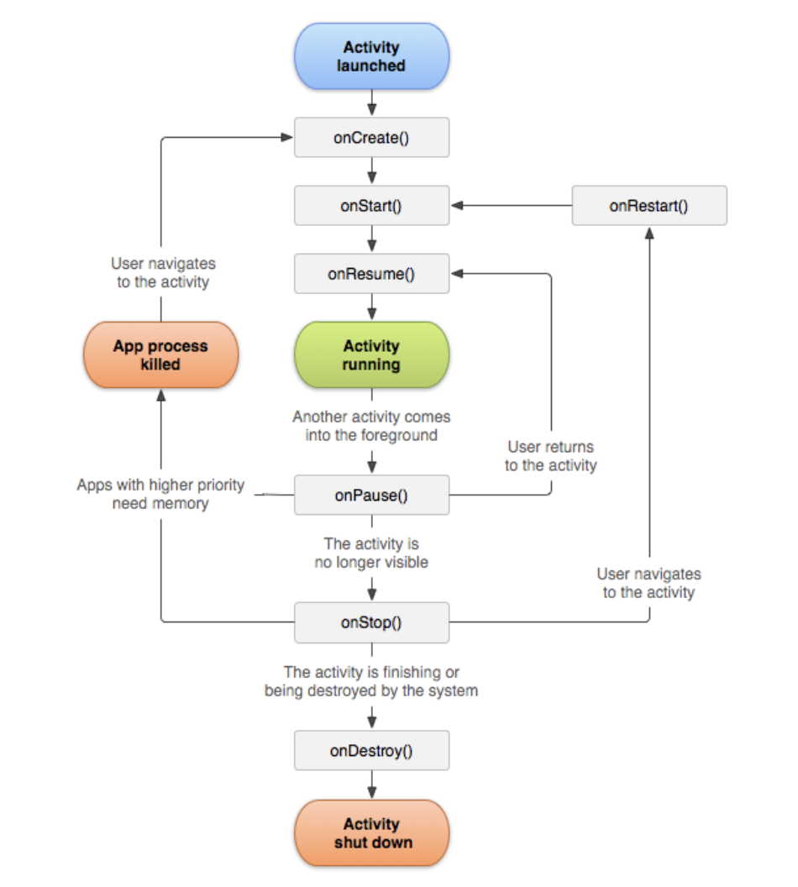
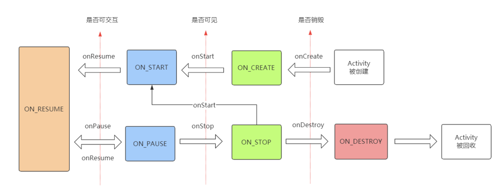

####  Activity 生命周期

#####  正常情况下的生命周期

onCreate -> onStart -> onResume 

-> 处于可交互状态

-> onPause -> onStop -> onDestory





onCreate: 表示 Activity 正在被创建

onStart: 表示 Activity 正在被启动，这个时候 Activity 已经可见，但是还没出现在前台，还无法和用户进行交互

onResume: 表示 Activity 已经可见了，出现在前台，可以和用户进行交互

onPause: 表示 Activity 正在停止，此时可以做些轻量极的数据操作，不能太耗时，否则会影响新的 Activity 的显示

onStop: 表示 Activity 即将停止，可以做一些稍重量极的数据操作，同样不能太耗时

onDestory: 表示 Activity 即将被销毁，可以做一些资源释放的操作

onRestart: 表示 Activty 正在被重新启动，当 Activity 从不可见状态回到可见状态时，onRestart 就会被调用


#####  onStart/onStop 和 onResume/onPause 区别

onStart 和 onStop 是从 Activity 是否可见这个角度来回调的

onResume 和 onPause 是从是否位于前台这个角度来回调的


####  异常情况下的生命周期

1. 当资源相关的系统配置发生改变，会导致 Activity 被杀死并且会重新创建。

比如旋转屏幕，这种情况下由于系统配置发生了变化， Activity 就会被销毁并且重新创建。

当系统配置发生变化，Activity 会被销毁，onPause、onStop、onDestory 方法都会被调用，由于是异常情况下终止的，系统还会调用 onSaveInstanceState 方法来保存当前 Activity 的状态，当 Activity 被重新创建后，系统会调用 onRestoreInstanceState 方法 恢复在 onSaveInstanceState 中保存的数据。

在 onSaveInstanceState 和 onRestoreInstanceState 中，系统自动为我们做了一定的恢复工作，比如 文本框中用户输入的数据、ListView 滚动的位置，相对应的 View 有 onSaveInstaceState 和 onRestoreInstaceState 这两个方法。

当 Activity 被意外终止时，Activity 会调用 onSaveInsatanceState 去保存数据，然后 Activity 会委托 Window 去保存数据，接着 Window 在委托它上面的顶层容器去保存数据，顶层容器是一个 ViewGroup，顶层容器再去一一通知它的子元素来保存数据。


2. 系统内存不足时，会导致优先级低的 Activity 所在进程被杀死

Activity 按照优先级从高到低分为三种情况：

（1）前台 Activity，正在和用户交互的 Activity，优先级最高

（2）可见但非前台 Activity，执行了 onPause 方法，比如 弹出了一个对话框

（3）后台 Activity，执行了 onStop 方法，优先级最低

当系统内存不足时，系统会按照上述优先级杀死目标 Activity 所在的进程，如果一个进程中没有四大组件执行，那么这个进程很快就会被杀死。因此，一些后台工作不适合脱离四大组件独自在后台运行，这样进程很容易被杀死，比较好的做法是开启一个前台服务，这样进程就不会轻易的被系统杀死。


系统配置中有很多内容，当某项内容发生变化后，不想让系统重新创建 Activity ，可以给 Activity 指定 configChanges 属性。比如不想让 Actvity 在屏幕旋转的时候重新创建，就可以给 configChanges 属性添加 orientation 这个值

```xml
android:configChanges="orientation|screenSize|keyboardHidden"
```

取而代之调用的是 Activity 的 onConfigurationChanged 方法


