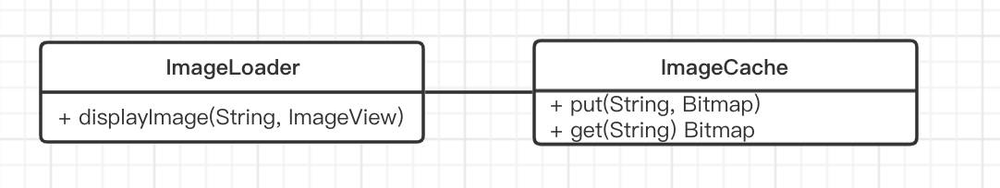
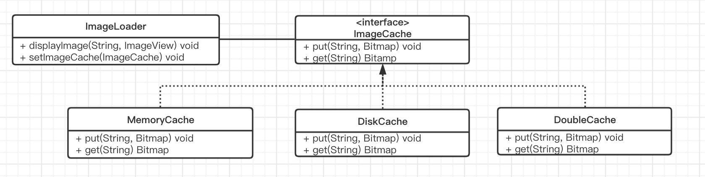
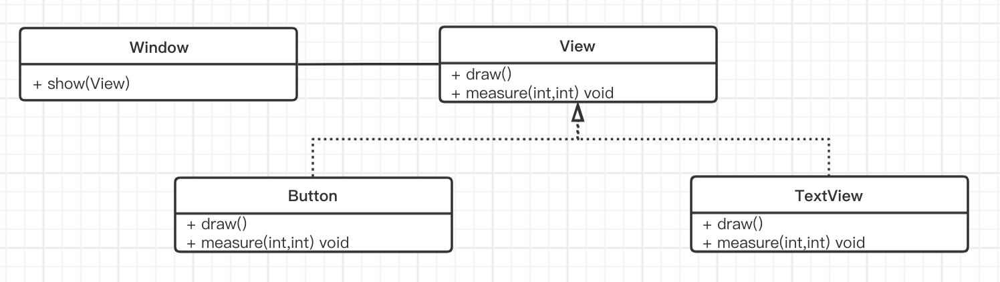

### 第1章 面向对象的六大原则

#####  1.1单一职责原则

简称 SRP (Single Responsibility Principle)，对于一个类来说，应该仅有一个引起它变化的原因。


实现图片加载，并且将图片缓存起来。

```java
/**
 * Describe:图片加载类
 */
public class ImageLoader {
    // 图片缓存
    LruCache<String, Bitmap> mImageCache;
    // 线程池，线程数量为 CPU 的数量
    ExecutorService mExecutorService = Executors.newFixedThreadPool(Runtime.getRuntime().availableProcessors());

    public ImageLoader() {
        initImageCache();
    }

    private void initImageCache() {
        // 计算可使用的最大内存
        final int maxMemory = (int) (Runtime.getRuntime().maxMemory() / 1024);
        // 取 1/4 的可用内存作为缓存
        final int cacheSize = maxMemory / 4;
        mImageCache = new LruCache<String, Bitmap>(cacheSize) {
            @Override
            protected int sizeOf(String key, Bitmap bitmap) {
                return bitmap.getRowBytes() * bitmap.getHeight() / 1024;
            }
        };

    }

    public void displayImage(final String url, final ImageView imageView) {
      	Bitmap bitmap = mImageCache.get(url);
        if (bitmap != null) {
            imageView.setImageBitmap(bitmap);
            return;
        }
        imageView.setTag(url);
        mExecutorService.submit(new Runnable() {
            @Override
            public void run() {
                Bitmap bitmap = downloadImage(url);
                if (bitmap == null) {
                    return;
                }
                if (imageView.getTag().equals(url)) {
                    imageView.setImageBitmap(bitmap);
                }
                mImageCache.put(url, bitmap);
            }
        });
    }

    public Bitmap downloadImage(String imgUrl) {
        Bitmap bitmap = null;
        try {
            URL url = new URL(imgUrl);
            HttpURLConnection conn = (HttpURLConnection) url.openConnection();
            bitmap = BitmapFactory.decodeStream(conn.getInputStream());
            conn.disconnect();
        } catch (Exception e) {
            e.printStackTrace();
        }
        return bitmap;
    }
}
```


拆分 ImageLoader ,把各个功能独立出来，让它们满足单一职责原则。



```java
/**
 * Describe:图片加载类
 */
public class ImageLoader {

    // 图片缓存
    ImageCache mImageCache = new ImageCache();
    // 线程池，线程数量为 CUP 的数量
    ExecutorService mExecutorService = Executors.newFixedThreadPool(Runtime.getRuntime().availableProcessors());
    
    // 加载图片
    public void displayImage(final String url, final ImageView imageView) {
      	Bitmap bitmap = mImageCache.get(url);
        if (bitmap != null) {
            imageView.setImageBitmap(bitmap);
            return;
        }
        imageView.setTag(url);
        mExecutorService.submit(new Runnable() {
            @Override
            public void run() {
                Bitmap bitmap = downloadImage(url);
                if (bitmap == null) {
                    return;
                }
                if (imageView.getTag().equals(url)) {
                    imageView.setImageBitmap(bitmap);
                }
                mImageCache.put(url, bitmap);
            }
        });
    }

    public Bitmap downloadImage(String imgUrl) {
        Bitmap bitmap = null;
        try {
            URL url = new URL(imgUrl);
            HttpURLConnection conn = (HttpURLConnection) url.openConnection();
            bitmap = BitmapFactory.decodeStream(conn.getInputStream());
            conn.disconnect();
        } catch (Exception e) {
            e.printStackTrace();
        }
        return bitmap;
    }
}
```

```java
/**
 * Describe:图片缓存类
 */
public class ImageCache {

    // 图片缓存
    LruCache<String, Bitmap> mImageCache;

    public ImageCache() {
        initImageCache();
    }

    private void initImageCache() {
        // 计算可使用的最大内存
        final int maxMemory = (int) (Runtime.getRuntime().maxMemory() / 1024);
        // 取 1/4 的可用内存作为缓存
        final int cacheSize = maxMemory / 4;
        mImageCache = new LruCache<String, Bitmap>(cacheSize) {
            @Override
            protected int sizeOf(String key, Bitmap bitmap) {
                return bitmap.getRowBytes() * bitmap.getHeight() / 1024;
            }
        };
    }

    public void put(String url, Bitmap bitmap) {
        mImageCache.put(url, bitmap);
    }

    public Bitmap get(String url) {
        return mImageCache.get(url);
    }
}
```

将 ImageLoader 拆分，ImageLoader 只负责图片加载逻辑，ImageCache 负责图片缓存，这样 ImageLoader 代码量变少了，职责也比较清晰。当与缓存相关的逻辑需要改变时，不需要修改 ImageLoader 类，而图片加载的逻辑需要修改时也不会影响到缓存逻辑处理。

两个完全不一样功能不应该放在同一个类中，一个类中应该是相关性很高的函数、数据的封装。我们需要不断审视自己的代码，根据具体的业务、功能进行相对应的拆分，这是程序员优化代码的第一步。


##### 1.2开闭原则

简称 OCP (Open Close Principle)，软件中的对象（类、模块、函数等）应该对于扩展是开放的，对修改是封闭的。在软件的生命周期中，因为变化，升级和维护等需要对软件原有代码修改时，可能会将错误引入到原本已经经过测试的旧代码中，破坏原有系统。因此在软件需要变化时，我们应该尽量通过扩展的方式来升级、维护原有系统，而不是通过修改已有代码来实现。


经过第一轮重构之后的 ImageLoader 通过内存缓存加载图片，但 android 内存有限，且具有易失性，当应用重新启动后，原来已经加载过的图片就会丢失，考虑之后，开始引入 SD 卡缓存。

```java
/**
 * Describe:图片加载类
 */
public class ImageLoader {

    // 图片缓存
    ImageCache mImageCache = new ImageCache();
    // SD缓存
    DiskCache mDiskCache = new DiskCache();
    // 是否使用 SD 卡缓存
    boolean isUseDiskCache = false;
    // 线程池，线程数量为 CUP 的数量
    ExecutorService mExecutorService = Executors.newFixedThreadPool(Runtime.getRuntime().availableProcessors());

    // 加载图片
    public void displayImage(final String url, final ImageView imageView) {
        Bitmap bitmap = isUseDiskCache ? mDiskCache.get(url) : mImageCache.get(url);
        if (bitmap != null) {
            imageView.setImageBitmap(bitmap);
            return;
        }
        imageView.setTag(url);
        mExecutorService.submit(new Runnable() {
            @Override
            public void run() {
                Bitmap bitmap = downloadImage(url);
                if (bitmap == null) {
                    return;
                }
                if (imageView.getTag().equals(url)) {
                    imageView.setImageBitmap(bitmap);
                }
                if (isUseDiskCache) {
                    mDiskCache.put(url, bitmap);
                } else {
                    mImageCache.put(url, bitmap);
                }
            }
        });
    }

    public void useDiskCache(boolean useDiskCache) {
        isUseDiskCache = useDiskCache;
    }

    public void setUseDiskCache(boolean useDiskCache) {
        isUseDiskCache = useDiskCache;
    }

    public Bitmap downloadImage(String imgUrl) {
        Bitmap bitmap = null;
        try {
            URL url = new URL(imgUrl);
            HttpURLConnection conn = (HttpURLConnection) url.openConnection();
            bitmap = BitmapFactory.decodeStream(conn.getInputStream());
            conn.disconnect();
        } catch (Exception e) {
            e.printStackTrace();
        }
        return bitmap;
    }
}
```

```java
/**
 * Describe:SD卡缓存
 */
public class DiskCache {

    static final String cacheDir = "sdcard/cache/";

    // 从缓存中获取图片
    public Bitmap get(String url) {
        return BitmapFactory.decodeFile(cacheDir + url);
    }

    // 将图片缓存到SD中
    public void put(String url, Bitmap bitmap) {
        FileOutputStream fileOutputStream = null;
        File file;
        try {
            fileOutputStream = new FileOutputStream(cacheDir + url);
            bitmap.compress(Bitmap.CompressFormat.PNG, 100, fileOutputStream);
        } catch (Exception e) {
            e.printStackTrace();
        } finally {
            if (fileOutputStream != null) {
                try {
                    fileOutputStream.close();
                } catch (IOException e) {
                    e.printStackTrace();
                }
            }
        }
    }

}

```


每次加新的缓存方法都需要修改原来的代码，这样很可能会引起 bug ,而且会原有的逻辑变得越来越复杂，按照这种写法，用户也不能自定义实现缓存。

分析代码，在每次加入新的缓存的时候都需要修改 ImageLoader 类，然后通过一个 boolean 值来确定使用哪种缓存，随着这些逻辑的引入，代码变得越来也复杂，ImageLoader 也会变得臃肿，可扩展性很差。




```java
/**
 * Describe:
 */
public interface ImageCache {

    Bitmap get(String url);

    void put(String url, Bitmap bitmap);
}
```

```java
/**
 * Describe:图片加载类
 */
public class ImageLoader {

    private ImageCache mImageCache = new MemoryCache();

    // 线程池，线程数量为 CUP 的数量
    ExecutorService mExecutorService = Executors.newFixedThreadPool(Runtime.getRuntime().availableProcessors());

    // 注入缓存实现
    public void setImageCache(ImageCache imageCache) {
        mImageCache = imageCache;
    }

    // 加载图片
    public void displayImage(final String url, final ImageView imageView) {
        Bitmap bitmap = mImageCache.get(url);
        if (bitmap != null) {
            imageView.setImageBitmap(bitmap);
            return;
        }
        imageView.setTag(url);
        mExecutorService.submit(new Runnable() {
            @Override
            public void run() {
                Bitmap bitmap = downloadImage(url);
                if (bitmap == null) {
                    return;
                }
                if (imageView.getTag().equals(url)) {
                    imageView.setImageBitmap(bitmap);
                }
                mImageCache.put(url, bitmap);
            }
        });
    }

    public Bitmap downloadImage(String imgUrl) {
        Bitmap bitmap = null;
        try {
            URL url = new URL(imgUrl);
            HttpURLConnection conn = (HttpURLConnection) url.openConnection();
            bitmap = BitmapFactory.decodeStream(conn.getInputStream());
            conn.disconnect();
        } catch (Exception e) {
            e.printStackTrace();
        }
        return bitmap;
    }
}
```


```java
/**
 * Describe:图片缓存类
 */
public class MemoryCache implements ImageCache{

    // 图片缓存
    LruCache<String, Bitmap> mImageCache;

    public MemoryCache() {
        initImageCache();
    }

    private void initImageCache() {
        // 计算可使用的最大内存
        final int maxMemory = (int) (Runtime.getRuntime().maxMemory() / 1024);
        // 取 1/4 的可用内存作为缓存
        final int cacheSize = maxMemory / 4;
        mImageCache = new LruCache<String, Bitmap>(cacheSize) {
            @Override
            protected int sizeOf(String key, Bitmap bitmap) {
                return bitmap.getRowBytes() * bitmap.getHeight() / 1024;
            }
        };
    }

    @Override
    public void put(String url, Bitmap bitmap) {
        mImageCache.put(url, bitmap);
    }

    @Override
    public Bitmap get(String url) {
        return mImageCache.get(url);
    }
}
```


```java
/**
 * Describe:SD卡缓存
 */
public class DiskCache implements ImageCache {

    static final String cacheDir = "sdcard/cache/";

    // 从缓存中获取图片
    @Override
    public Bitmap get(String url) {
        return BitmapFactory.decodeFile(cacheDir + url);
    }

    // 将图片缓存到SD中
    @Override
    public void put(String url, Bitmap bitmap) {
        FileOutputStream fileOutputStream = null;
        File file;
        try {
            fileOutputStream = new FileOutputStream(cacheDir + url);
            bitmap.compress(Bitmap.CompressFormat.PNG, 100, fileOutputStream);
        } catch (Exception e) {
            e.printStackTrace();
        } finally {
            if (fileOutputStream != null) {
                try {
                    fileOutputStream.close();
                } catch (IOException e) {
                    e.printStackTrace();
                }
            }
        }
    }

}
```


```java
/**
 * Describe: 双缓存类
 */
public class DoubleCache implements ImageCache {

    private ImageCache mMemoryCache = new MemoryCache();
    private ImageCache mDiskCache = new DiskCache();

    @Override
    public Bitmap get(String url) {
        Bitmap bitmap = mMemoryCache.get(url);
        if (bitmap == null) {
            bitmap = mDiskCache.get(url);
        }
        return bitmap;
    }

    @Override
    public void put(String url, Bitmap bitmap) {
        mMemoryCache.put(url, bitmap);
        mDiskCache.put(url, bitmap);
    }

}
```


经过这次重构，没有了那么多的 if-else 语句，代码简单清晰了，ImageCache 抽取成了一个图片缓存的接口，用于图片缓存的功能。

ImageCache 接口简单定义了获取、缓存图片两个函数。ImageLoader 类中增加了一个 setImageCache(ImageCache cache) 的函数，用户可以通过该函数设置缓存，也就是通常说的依赖注入。通过 setImageCache 方法注入不同的缓存实现，使得 ImageLoader 的可扩展性，灵活性更高，当用户需要自定义缓存策略的时候，只需要新建一个实现 ImageCache 接口的类。


#####  1.3里氏替换原则

所有引用基类的地方都必须透明的使用其子类的对象。




```java
/**
 * Describe:窗口类
 */
public class Window {
    public void show(View child) {
        child.draw();
    }
}

/**
 * Describe:建立视图抽象，测量视图的宽高为公有代码，绘制实现交给具体的子类
 */
public abstract class View {
    public abstract void draw();

    public void mesure(int width, int height) {
        // 测量视图大小
    }
}

/**
 * Describe:按钮的具体实现
 */
public class Button extends View {
    @Override
    public void draw() {
        // 绘制按钮
    }
}

/**
 * Describe:TextView的具体实现
 */
public class TextView extends View {
    @Override
    public void draw() {
        // 绘制文本
    }
}
```


示例中，Window 依赖于 View，而 View 定义了一个视图抽象，measure 是各个子类共享的方法，子类通过复写 View 的 draw 方法实现具有各自特色的功能。

##### 1.4依赖倒置原则

Dependence Inversion Principle(DIP)

面向接口编程，如果类与类直接依赖于细节，那么他们之间就有直接的耦合，当具体实现需要变化时，意味着同时修改依赖者的代码，这限制了系统的可扩展性。

#####  1.5接口隔离原则

InterfaceSegregation Principles(ISP)

类间的依赖关系应该建立在最小的接口上。

在使用了 OutputStream 或者其他可关闭的对象之后，我们必须保证它们最终被关闭了

```java
// 将图片缓存到SD中
@Override
public void put(String url, Bitmap bitmap) {
    FileOutputStream fileOutputStream = null;
    File file;
    try {
        fileOutputStream = new FileOutputStream(cacheDir + url);
        bitmap.compress(Bitmap.CompressFormat.PNG, 100, fileOutputStream);
    } catch (Exception e) {
        e.printStackTrace();
    } finally {
        if (fileOutputStream != null) {
            try {
                fileOutputStream.close();
            } catch (IOException e) {
                e.printStackTrace();
            }
        }
    }
}
```

这段代码可读性比较差，各种 try...catch 嵌套，会严重影响代码的可读性。我们可能知道 Java 中有一个 Closeable 接口，该接口标识了一个可关闭的对象，它只有一个 close 方法。我们使用的 FileOutputStream 类就实现了这个接口，在 Java 中还有 100 个类实现了 Closeable 这个接口，意味着关闭这 100 多个类型的对象时，都需要写出 fianally 代码段那样的代码。

既然都是实现了 Closeable 接口，那只要建一个统一的方法关闭这个对象不就可以了。

```java
public class CloseUtils {

    private CloseUtils() {
    }

    /**
     * 关闭 Closeable 对象
     *
     * @param closeable
     */
    public static void closeQuietly(Closeable closeable) {
        if (closeable != null) {
            try {
                closeable.close();
            } catch (IOException e) {
                e.printStackTrace();
            }
        }
    }
}
```

```java
// 将图片缓存到SD中
@Override
public void put(String url, Bitmap bitmap) {
    FileOutputStream fileOutputStream = null;
    File file;
    try {
        fileOutputStream = new FileOutputStream(cacheDir + url);
        bitmap.compress(Bitmap.CompressFormat.PNG, 100, fileOutputStream);
    } catch (Exception e) {
        e.printStackTrace();
    } finally {
        CloseUtils.closeQuietly(fileOutputStream);
    }
}
```

CloseUtils 的 closeQuietly 方法的基本原理就是依赖于 Closeable 抽象而不是具体实现，这不就是1.4中的依赖倒置原则么，并且建立在最小依赖原则的基础上，他只需要知道这个对象是可关闭，其他的一概不关心，也就是这里的接口隔离原则。

#####  1.6迪米特原则

Law of Demeter(LOD)

一个对象对其他对象有最少的了解。类与类的关系越密切，耦合度越大，当一个类发生变化时，对另一个类的影响也越大。


在应用开发过程中，最难的不是完成应用开发的工作，而是在后续升级，维护过程中让应用系统能够拥抱变化。拥抱变化意味着在满足需求且不破坏系统稳定性的前提保持可扩展性、高内聚、低耦合。


###  第2章 单例模式

在应用这个模式时，单例对象的类必须保证只有一个实例存在。

避免产生多个对象消耗过多的资源。

在获取这个单例对象的过程需要确保线程安全，即在多线程环境下构造的单例类的对象也是有且只有一个，这也是单例模式实现中比较困难的地方。

#####  2.1饿汉式

在声明静态对象的时候就已经初始化了，保证了对象的唯一性。

```java
/**
 * Describe:饿汉式
 */
public class Singleton {

    private static Singleton instance = new Singleton();

    // 构造函数私有
    private Singleton() {
    }

    public static Singleton getInstance() {
        return instance;
    }
}
```

#####  2.2懒汉模式

是声明一个静态变量，在用户第一次调用 getInstance 时进行初始化。

```java
/**
 * Describe:懒汉式
 */
public class Singleton {

    private static Singleton instance;

    // 构造函数私有
    private Singleton() {
    }

    public static synchronized Singleton getInstance() {
        if (instance == null) {
            instance = new Singleton();
        }
        return instance;
    }
}
```

在 getInstance 上添加了 synchronized 关键字，也就是 getInstance 是一个同步方法，多线程的情况下保证单例对象的唯一性。

每次调用 getInstance 方法都会进行同步，这样会消耗不必要的资源，这也是懒汉单例模式存在的最大的问题。这种模式一般不建议使用。


#####  2.3Double Check Lock

双重检查锁定模式

```java
/**
 * Describe:DCL
 */
public class Singleton {

    private static Singleton instance;

    // 构造函数私有
    private Singleton() {
    }

    public static Singleton getInstance() {
        if (instance == null) {
            synchronized (Singleton.class) {
                if (instance == null) {
                    instance = new Singleton();
                }
            }
        }
        return instance;
    }
}
```

DCL 模式能够在需要的时候才初始化单例，又能够保证线程安全，且单例对象初始化后调用 getInstance 不进行同步锁。

在 getInstance 方法中对 instance 进行了两次判空；第一层判空主要是为了避免不必要的同步；第二层判空为了在 null 的情况下创建实例，这是什么意思，我们来分析一下。

假设线程 A 执行到 instance = new Singleton() 语句，这里看起是一句代码，但实际它不是一个原子操作，这句代码会被编译成多条汇编指令：

1. 给 Singleton 的实例分配内存
2. 调用 Singleton() 的构造函数，初始化成员字段；
3. 将 intance 对象指向分配的内存空间（此时 intance 就不是 null 了）

在 JDK 1.5 之前，2 和 3 的执行顺序不能保证，如果执行顺序是 1-3-2，切换到 B 线程的上，这时 instance 因为已经在 A 线程执行过了 3 ，instance 已经是非空了，线程 B 直接取走 instance 使用时就会出错。

在 JDK 1.5 之后，SUN 官方已经注意到这个问题，调整了 JVM，具体化了 volatitle 关键字，只需要将 instance 定义改成 private volatile static Singleton instance，就可以保证 instance 对象每次都从主内存中读取


#####  2.4静态内部类单例

```java
/**
 * Describe:静态内部类单例模式
 */
public class Singleton {

    // 构造函数私有
    private Singleton() {
    }

    public static Singleton getInstance() {
        return SingletonHolder.instance;
    }

    private static class SingletonHolder {
        private static final Singleton instance = new Singleton();
    }
}
```

当第一次加载 Singleton 类时并不会初始化 instance ,只有在第一次调用 getInstance 方法才会导致 instance 初始化。因次，第一次调用 getInstance 方法会导致虚拟机加载 SingletonHoler 类，这种方式不仅能够保证线程安全，也能够保证单例对象的唯一性，同时延迟了单例的实例化，所以推荐使用这个方式实现单例。

#####  2.5枚举单例

```java
/**
 * Describe:枚举单来
 */
public enum Singleton {

    INSTANCE;

    public void doSomething() {
        
    }
}
```


枚举在 Java 中与普通的类是一样的，不仅能够有字段，还能够有自己的方法，最重要的是默认枚举实例的创建是线程安全的，并且任何情况下它都是一个单例。

为什么这么说呢？上述的几种单例模式实现中，在一种情况下它们会出现重新创建对象的情况，那就是发序列化。

通过序列化可以将一个单例的实例对象写到磁盘，然后在读回来，从而有效的获得一个实例。如果要杜绝单例对象在反序列化时重新生成对象，那么必须加入如下方法：

```java
private Object readResolve() throws ObjectStreamException {
	return instance;
}
```


#####  2.6使用容器实现单例模式

```java
/**
 * Describe:使用容器实现单例模式
 */
public class SingletonManager {

    private static Map<String, Object> objMap = new HashMap<>();

    private SingletonManager() {
    }

    public static void registerService(String key, Object instance) {
        if (!objMap.containsKey(key)) {
            objMap.put(key, instance);
        }
    }

    public static Object getService(String key) {
        return objMap.get(key);
    }
}
```

在程序的初始化时，将多种类型注入到一个统一的管理类中，在使用时根据 key 获取对象对应类型的对象，这种方式使得我们可以管理多种类型的单例，并且在使用时可以通过统一的接口进行获取操作。


不管哪种形式实现的单例模式，他们的核心原理都是将构造函数私有化，并且通过静态方法获取一个唯一的的单例，在这个获取过程中必须保证线程安全、防止序列化导致的重新生成实例对象等问题。


