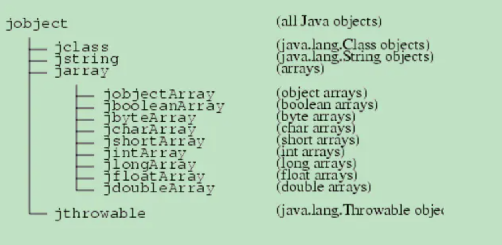

###  JNI概念

从 JVM 角度，存在 两种类型的代码，“java”和“native”，native一般指 c/c++，为了使 java 和 native 进行交互，java 设计了 JNI （java native initerface）.

代码效率上，使用 native 代码的性能更高

native 层使用 JNI 可以做到：

- 创建、检查和更新 Java 对象

- 调用 Java 方法

- 加载类并获取信息

###  创建 android ndk 项目

使用 as 创建一个 native c++ 项目，创建项目的使用选择 Native C++

###  native 代码解读

**extern C**

在 c++ 使用 c 代码

**JNIEXPORT**

宏定义

**JNICALL**

宏定义

**JNIEnv**

- JNIEnv 类型实际代表了 Java 环境，通过 JNIEnv* 指针，就可以对 Java 端的代码进行操作

  调用 Java 函数

  操作 Java 对象

- JNIEnv 的本质是一个与线程相关的结构体，里面存放了大量的 JNI 函数指针

**JavaVM**

- JavaVM: JavaVM 是 Java 虚拟机在 JNI 层的代表，JNI 全局只有一个
- JNIEnv: JavaVM 在线程中的代表，每一个线程都有一个，JNI 中可能有很多个 JNIEnv

**Jobject thiz**

这个 object 指向该 native 方法的 this 实例

###  JNI 基础

数据类型

**基础数据类型**

| Java Type | Native Type | Description      |
| --------- | ----------- | ---------------- |
| boolean   | jboolean    | unsigned 8 bits  |
| byte      | jbyte       | signed 8 bits    |
| char      | jchar       | unsigned 16 bits |
| short     | jshort      | signed 16 bits   |
| int       | jint        | signed 32 bits   |
| long      | jlong       | signed 64 bits   |
| float     | jfloat      | 32 bits          |
| double    | jdouble     | 64 bits          |
| void      | void        | N/A              |
|           |             |                  |

**引用类型**




**Field and Method IDs**

JNIEnv 操作 java 对象时利用 java 中的反射，操作某个属性都需要 field 和 method 的 id ，这些 id 都是指针类型

```c
struct _jfieldID;              /* opaque structure */ 
typedef struct _jfieldID *jfieldID;   /* field IDs */ 
 
struct _jmethodID;              /* opaque structure */ 
typedef struct _jmethodID *jmethodID; /* method IDs */

```


### JNI 操作 Java 对象

**操作 jarray**

```c++
JNIEXPORT void JNICALL Java_com_pax_cdemo_ActiveCodeUtils_setArray
        (JNIEnv *env, jclass clazz, jintArray array) {

    // 1.获取数组长度
    jsize len = env->GetArrayLength(array);
    LOGD("数组长度: %d", len);

    jboolean isCopy;
    // 2.获取数组地址
    // 第二个参数代表 javaArray -> c/c++ Array 转换方式
    // 0: 把指向 Java 数组的指针直接传回到本地代码中
    // 1: 新申请了内存，拷贝了数组
    // 返回值：数组的地址（首元素地址）
    jint *firstElement = env->GetIntArrayElements(array, &isCopy);
    LOGD("是否是拷贝了数组: %d", isCopy);
    // 3.遍历数组
    for (int i = 0; i < len; ++i) {
        LOGD("array[%i] = %i", i, *(firstElement + i));
    }
    // 4.使用后释放数组
    // 第一个参数是 jarray, 第二个参数 GetIntArrayElements 的返回值
    // 第三个参数代表 mode
    //  mode = 0 刷新java数组 并 释放c/c++数组
    //  mode = JNI_COMMIT (1) 只刷新java数组
    //  mode = JNI_ABORT (2) 只释放c/c++数组
    env->ReleaseIntArrayElements(array, firstElement, 0);

    // 5.新建一个 Java 数组
    jintArray newArray = env->NewIntArray(3);
}
```

**操作jstring**

```c++
extern "C"
JNIEXPORT void JNICALL Java_com_pax_cdemo_ActiveCodeUtils_setString
        (JNIEnv *env, jclass clazz, jstring str) {

    // 1.jstring -> char*
    // java 中的字符串是 unicode 编码， c/c++ 是 UTF 编码，所以需要进行转换
    const char *c_str = env->GetStringUTFChars(str, NULL);

    // 2.异常处理
    if (c_str == NULL) {
        return;
    }

    // 3.当做一个 char 数组打印
    jsize len = env->GetStringLength(str);
    for (int i = 0; i < len; ++i) {
        LOGD("c_str: %c", *(c_str + i));
    }

    // 4.释放
    env->ReleaseStringUTFChars(str, c_str);
}
```

调用完 GetStringUTFChars 之后不要忘记安全检查，因为 JVM 需要为新诞生的字符串分配内存空间，当内存空间不够分配的时候，会导致调用失败，失败后 GetStringUTFChars 会返回 NULL，并抛出一个OutOfMemoryError 异常。JNI 的异常和 Java 中的异常处理流程是不一样的，Java 遇到异常如果没有捕获，程序会立即停止运行。而 JNI 遇到未决的异常不会改变程序的运行流程，也就是程序会继续往下走，这样后面针对这个字符串的所有操作都是非常危险的，因此，我们需要用 return 语句跳过后面的代码，并立即结束当前方法。


**操作 jobject**

- c/c++ 操作 Java 中的对象使用的是 Java 中反射，步骤为

  1. 获取 class 类

  2. 根据成员变量名取 methodID/fieldID

  3. 调用 get/set 方法操作 field，或者 CallObjectMethod 调用 method

**操作 Field**

- 非静态成员变量使用：GetXXXField，比如 GetIntField，对于引用类型，比如 String ，使用 GetObjectField
- 静态变量使用：GetStaticXXXField，比如 GetStaticIntField

```c++
public class MainActivity extends AppCompatActivity {

    String testField = "test1";

    static int staticField = 1;
}

extern "C"
JNIEXPORT void JNICALL
Java_com_pax_cdemo_ActiveCodeUtils_getJavaField
        (JNIEnv *env, jclass clazz, jobject obj) {

    // 1.获取类 class
    jclass clazz2 = env->GetObjectClass(obj);
    // 2.获取成员变量 id
    jfieldID strFiledId = env->GetFieldID(clazz2, "testField", "Ljava/lang/String;");
    // 3.根据 id 获取值
    jstring jstr = static_cast<jstring>(env->GetObjectField(obj, strFiledId));
    const char *cStr = env->GetStringUTFChars(jstr, NULL);
    LOGD("获取 MainActivity 的 String field : %s", cStr);

    // 4.修改 String
    jstring newString = env->NewStringUTF("新的字符串");
    env->SetObjectField(obj, strFiledId, newString);

    // 5.获取静态变量
    jfieldID staticIntFieldId = env->GetStaticFieldID(clazz2, "staticfield", "I");
    jint staticJavaInt = env->GetStaticIntField(clazz2, staticIntFieldId);
    LOGD("获取 MainActivity 的 int field : %d", staticJavaInt);

    // 6.释放资源
    env->ReleaseStringUTFChars(jstr, cStr);
    env->DeleteLocalRef(newString);
    env->DeleteLocalRef(clazz2);

}
```

**GetFieldID 和 GetStaticFiledID 需要三个参数**

- jclass
- filed name
- 类型签名：JNI 使用 jvm 的类型签名


**类型签名一览表**

| Type                     | Signature Java Type   |
| ------------------------ | --------------------- |
| Z                        | boolean               |
| B                        | byte                  |
| C                        | char                  |
| S                        | short                 |
| I                        | int                   |
| J                        | long                  |
| F                        | float                 |
| D                        | double                |
| V                        | void                  |
| L fully-qualified-class; | fully-qualified-class |
| [type                    | type[]                |
| (arg-types) ret-type     | method type           |
|                          |                       |
|                          |                       |

- 基本数据类型比较好理解，比如要获取一个 int , GetFieldID 需要传入签名就是 I ;

- 如果是一个类，比如 String , 签名就是 L + 全类名;  >>>  Ljava.langString;

- 如果是一个 int array，就要写作  [I

- 如果要获取一个方法，那么方法的签名是：(参数签名)返回值签名，参数如果多个，中间不需要加分隔符，比如：

  | java 方法                       | JNI 签名                 |
  | ------------------------------- | ------------------------ |
  | void f(int n)                   | (I)V                     |
  | void f(String s, int n)         | (Ljava/lang/String;I)V   |
  | Long f(int n,String s,int[]arr) | (ILjava/lang/String;[I)J |
  |                                 |                          |

  

  **操作 method**

操作 method 和操作 filed 非常相似，先获取 MethodID，然后对应的 CallXXXMethod 方法

| Java 层返回值 | 方法族              | 本地返回类型 NativeType |
| ------------- | ------------------- | ----------------------- |
| void          | CallVoidMethod()    | （无）                  |
| 引用类型      | CallObjectMethod()  | jobject                 |
| boolean       | CallBooleanMethod() | jboolean                |
| byte          | CallByteMthod()     | jbyte                   |
| char          | CallCharMthod()     | jchar                   |
| short         | CallShortMethod()   | jshort                  |
| int           | CallIntMehtod()     | jint                    |
| long          | CallLongMethod()    | jlong                   |
| float         | CallFloatMehtod()   | jfloat                  |
| double        | CallDoubleMethod()  | jdouble                 |
|               |                     |                         |

在 Java 中我们想要获取 MainActivity 的 className 会这样写：

```java
this.getClass().getName()
```

那么在 native 方法如何调用：

```c++
extern "C"
JNIEXPORT jstring JNICALL Java_com_pax_cdemo_ActiveCodeUtils_getActiveCode
        (JNIEnv *env, jclass obj, jobject thiz, jstring code) {
    std::string hello = "active code";

    // 1. 获取 thiz 的 class，也就是 java 中的 Class 信息
    jclass thisclazz = env->GetObjectClass(thiz);
    // 2. 根据 Class 获取 getClass 方法的 methodID，第三个参数是签名(params)return
    jmethodID mid_getClass = env->GetMethodID(thisclazz, "getClass", "()Ljava/lang/Class;");
    // 3. 执行 getClass 方法，获得 Class 对象
    jobject clazz_instance = env->CallObjectMethod(thiz, mid_getClass);
    // 4. 获取 Class 实例
    jclass clazz = env->GetObjectClass(clazz_instance);
    // 5. 根据 class  的 methodID
    jmethodID mid_getName = env->GetMethodID(clazz, "getName", "()Ljava/lang/String;");
    // 6. 调用 getName 方法
    jstring name = static_cast<jstring>(env->CallObjectMethod(clazz_instance, mid_getName));
    LOGE("class name:%s", env->GetStringUTFChars(name, 0));

    // 7. 释放资源
    env->DeleteLocalRef(thisclazz);
    env->DeleteLocalRef(clazz);
    env->DeleteLocalRef(clazz_instance);
    env->DeleteLocalRef(name);


    return env->NewStringUTF(hello.c_str());
}
```

**创建对象**

首先定义一个 java 类

```java
public class Person {
    private int age;
    private String name;

    private Person(int age, String name) {
        this.age = age;
        this.name = name;
    }

    private void print() {
        Log.e("Person", name + " 今年 " + age + " 岁了");
    }
}
```

在 JNI 中创建一个 Person 并调用它的方法

```c++
extern "C"
JNIEXPORT void JNICALL
Java_com_pax_cdemo_ActiveCodeUtils_nativeInvokeJavaMethod(JNIEnv *env, jclass clazz) {

    // 1.获取 Class
    jclass pClass = env->FindClass("com/pax/cdemo/bean/Person");
    // 2.获取构造方法，方法名固定为 <init>
    jmethodID constructID = env->GetMethodID(pClass, "<init>", "(ILjava/lang/String;)V");
    if (constructID == NULL) {
        return;
    }
    // 3.创建一个 Person 对象
    jstring name = env->NewStringUTF("lingchenjie");
    jobject person = env->NewObject(pClass, constructID, 18, name);
    // 4.获取 methodID
    jmethodID printId = env->GetMethodID(pClass, "print", "()V");
    if (printId == NULL) {
        return;
    }
    env->CallVoidMethod(person, printId);

    // 5.释放资源
    env->DeleteLocalRef(pClass);
    env->DeleteLocalRef(name);
    env->DeleteLocalRef(person);

}
```


**JNI 引用**

JNI 分为三种引用：

- 局部引用（Local Reference），类似于 Java 中的局部变量
- 全局引用（Global Reference），类似于 Java 中的全局变量
- 弱全局引用（Weak Global Reference），类似于 Java 中的弱引用

上面的代码片段中最后都会有释放资源的代码，这是 c/c++ 编程的良好习惯，对于不同 JNI 引用有不同的释放方式。

**手动释放的方式**

- GetXXX 就必须调用 ReleaseXXX

  在调用 GetStringUTFChars 函数从 JVM 内部获取一个字符串之后，JVM 内部会分配一块新的内存，用于存储源字符串的拷贝，以便本地代码访问和修改。即然有内存分配，用完之后马上释放是一个编程的好习惯。通过调用ReleaseStringUTFChars 函数通知 JVM 这块内存已经不使用了。

- 对于手动创建的 jclass ，jobject 等对象使用 DeleteLocalRef 方法进行释放


**全局引用**

创建

JNI 允许从局部引用创建全局引用

```c++
static jstring globalStr;

if(globalStr == NULL) {
	jstring str = env->NewStringUTF("C++");
	// 从局部变量 str 创建一个全局变量
	globalStr = static_cast<jstring>(env->NewGlobalRef(str));
	
	// 局部可以释放，因为有了一个全局引用使用 str ,局部 str 也不会使用了
	env->DeleteLocalRef(str);
}
```

释放

全局引用在显式释放之前保持有效，可以通过 DeleteGlobalRef 来手动删除全局引用调用。


**弱全局引用**

与全局引用类似，弱引用可以跨方法、线程使用。与全局引用不同的是，弱引用不会阻止GC回收它所指向的VM内部的对象。

创建

```c++
static jclass globalClazz = NULL;

// 对于弱引用，如果引用的对象被回收返回 true ,否则为 false
// 对于局部和全局引用判断是否引用 Java 的 null 对象
jboolean isEqual = env->IsSameObject(globalClazz, NULL);
if(globalClazz == NULL || isEqual) {
	jclass clazz = env->GetObjectClass(instance);
	globalClazz = static_cast<jclass>(env->NewWeakGlobalRef(clazz));
	env->DeleteLocalRef(clazz);
}
```

释放

```c++
env->DeleteWeakGlobalRef()
```


参考资料：https://juejin.cn/post/6844904192780271630


