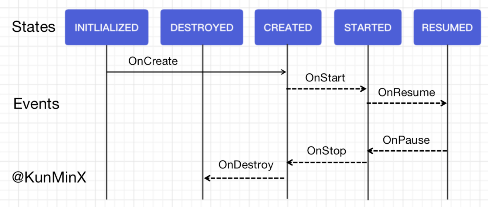

#####  Jetpack Lifecycle

Lifecycle 的存在，主要是为了解决 **生命周期管理** 的一致性问题

在 Lifecycle 之前，生命周期管理 纯靠手动维持，这样就容易滋生 大量一致性的问题。

#####  Lifecycle 为什么能解决这些问题

Lifecyele 通过 模板方法模式 和 观察者模式，将生命周期管理的复杂操作，全部在作为 LifecycleOwner 的基类中（例如视图管理器的基类）封装好，默默在背后为开发者运筹帷幄，

开发者因而得以在视图控制器（子类）中只需一句 **getLifecycle().addObserver(GpsManger.getInstance())** 优雅地完成 第三方组件在自己内部 对LifecycleOwner 生命周期的感知。

#####  Lifecyler 的作用

1. 实现生命周期 **管理的一致性**，做到 “一处修改、处处生效”。

2. 让第三方组件能够 **随时在自己内部拿到生命周期状态**，以便执行 **及时叫停 错过时机的 异步业务** 等操作。

3. 让第三方组件在调试时 能够 **更方便和安全地追踪到 事故所在的生命周期源**。

#####  LifecycleOwner 状态与事件

其实通过 官网的流程示意图（官网原图的事件全部大写，容易造成混淆，上图为我特别定制的版本，将事件改为驼峰命名）便可清晰直观地 Get 到：只有 onResume 和 onPause 是介于 STARTED、RESUMED 状态之间，也即 **只有这两个生命周期节点 100% 确定能收到 LiveData 的推送**（FragmentActivity 额外支持 onStart 期间的接收）

