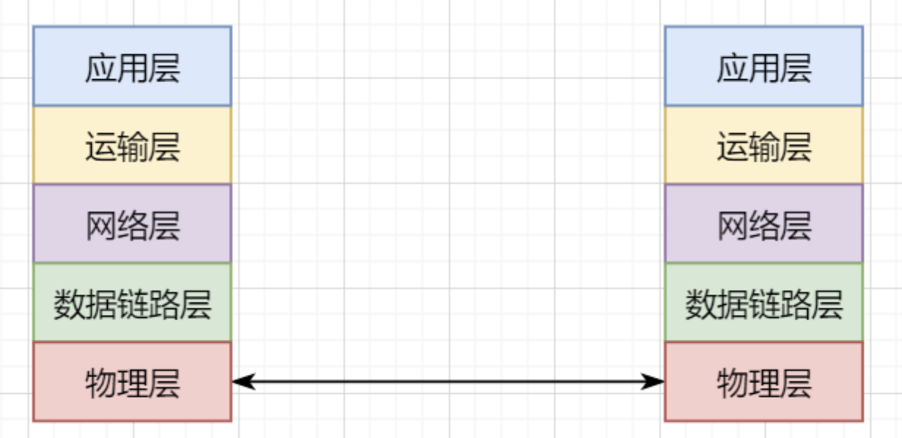
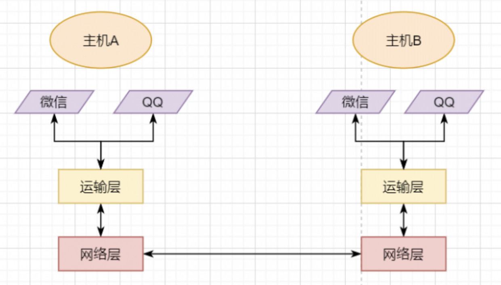
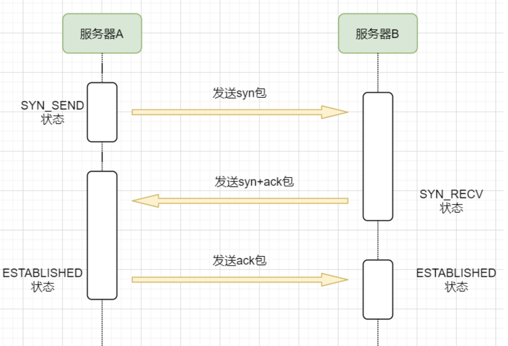
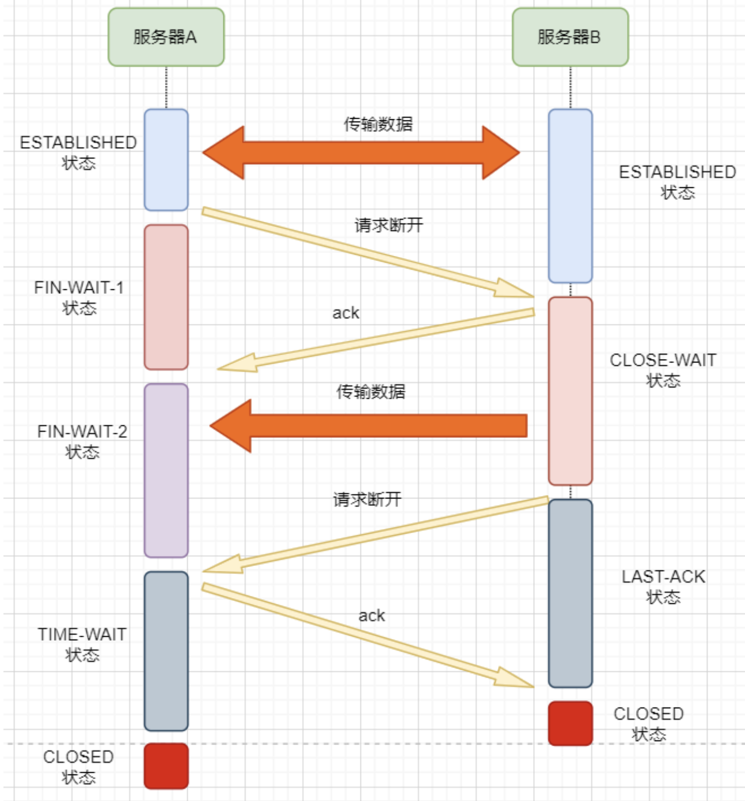

计算机网络的知识特点就是：琐碎。靠背诵“面试八股文”估计没多久就忘了。

TCP是计算机网络**运输层**的一个协议，所以首先要对计网分层结构以及运输层有一定的理解。

然后是TCP的四个重点：面向连接、可靠传输原理、流量控制和拥塞控制，最后再补充一点粘包和拆包的知识。


#####  物理层

考虑最简单的情况：两台主机之间的通信

这个时候只需要一条网线把两者连起来，规定好彼此的硬件接口，如都用USB、电压10v、频率2.4GHz等，**这一层就是物理层，这些规定就是物理层协议**


#####  数据链路层

我们当然不满足于只有两台电脑连接

可以使用交换机把多个电脑连接起来，这样连接起来的网络，称为局域网

在这个网络中，我们需要标识每个机器，这样才可以指定要和哪个机器通信。这个标识就是硬件地址MAC。硬件地址随机器的生产就被确定，永久性唯一

在局域网中，我们需要和另外的机器通信时，只需要知道他的硬件地址，交换机就会把我们的消息发送到对应的机器

这里我们可以不管底层的网线接口如何发送，把物理层抽离，在他之上创建一个新的层次，这就是**数据链路层** 


#####  网络层

我们依然不满足于局域网的规模

需要把所有的局域网联系起来，这个时候就需要用到路由器来连接两个局域网

但是如果我们还是使用硬件地址来作为通信对象的唯一标识，那么当网络规模越来越大，需要记住所有机器的硬件地址是不现实的；同时，一个网络对象可能会频繁更换设备，这个时候硬件地址表维护起来更加复杂。这里使用了一个新的地址来标记一个网络对象：**IP地址** 

IP地址就是一个网络接入地址，我只需要知道目标IP地址，路由器就可以把消息给我带到。**在局域网中，就可以动态维护一个MAC地址与IP地址的映射关系，根据目的IP地址就可以寻找到机器的MAC地址进行发送** 

我们不需管理底层如何去选择机器，我们只需要知道IP地址，就可以和我们的目标进行通信。这一层就是**网络层**。网络层的核心作用就是 **提供主机之间的逻辑通信**


#####  传输层

一个主机有多个进程，进程之间进行不同的网络通信，如边和朋友开黑边和女朋友聊微信。我的手机同时和两个不同机器进行通信。那么当我的手机收到数据时，如何区分是微信的数据，还是王者的数据？那么就必须在网络层之上再添加一层：**运输层** 

运输层通过socket（套接字），将网络信息进行进一步的拆分，不同的应用进程可以独立进行网络请求，互不干扰。这就是运输层的最本质特点：**提供进程之间的逻辑通信** 。这里的进程可以是主机之间，也可以是同个主机，所以在android中，socket通信也是进程通信的一种方式


#####  应用层

现在不同的机器上的应用进程之间可以独立通信了，那么我们就可以在计算机网络上开发出形形式式的应用：如web网页的http，文件传输ftp等等。这一层称为**应用层**


应用层还可以进一步拆分出表示层、会话层，但他们的本质特点都没有改变：**完成具体的业务需求** 




最底层物理层，负责两个机器之间通过硬件的直接通信；

数据链路层使用硬件地址在局域网中进行寻址，实现局域网通信；

网络层通过抽象IP地址实现主机之间的逻辑通信；

运输层在网络层的基础上，对数据进行拆分，实现应用进程的独立网络通信；

应用层在运输层的基础上，根据具体的需求开发形形式式的功能。


这里需要注意的是，分层并不是在物理上的分层，而是逻辑上的分层。通过对底层逻辑的封装，使得上层的开发可以直接依赖底层的功能而无需理会具体的实现，简便了开发。

这种分层的思路，也就是责任链设计模式，通过层层封装，把不同的职责独立起来，更加方便开发、维护等等。okHttp中的拦截器设计模式，也是这种责任链模式。


####  运输层

本文主要是讲解TCP，这里需要增加一些运输层的知识。

##### 本质：提供进程通信



在运输层之下的网络层，是不知道该数据包属于哪个进程，他只负责数据包的接收与发送。运输层则负责接收不同进程的数据交给网络层，同时把网络层的数据拆分交给不同的进程。从上往下汇聚到网络层，称为**多路复用**，从下往上拆分，称为**多路拆分** 。

运输层的表现，受网络层的限制。这很好理解，网络层是运输层的底层支持。所以运输层是无法决定自己带宽、时延等的上限。但可以基于网络层开发更多的特性：如可靠传输。网络层只负责尽力把数据包从一端发送到另一端，而不保证数据可以到达且完整。


##### 底层实现：socket

最简单的运输层协议，就是提供进程之间的独立通信 ，但底层的实现，是**socket之间的独立通信** 

在网络层中，IP地址是一个主机逻辑地址，而在运输层中，socket是一个进程的逻辑地址；当然，一个进程可以拥有多个socket。应用进程可以通过监听socket，来获取这个socket接受到的消息

socket并不是一个实实在在的东西，而是运输层抽象出来的一个对象。运输层增加了**端口**这个概念，来区分不同的socket。端口可以理解为一个主机上有很多的网络通信口


##### 运输层协议

运输层的协议就是大名鼎鼎的TCP和UDP。其中，UDP是最精简的运输层协议，只实现了进程间的通信；而TCP在UDP的基础上，实现了可靠传输、流量控制、拥塞控制、面向连接等等特性


####   TCP协议首部

TCP首部固定长度是20字节，下面还有4字节是可选的。内容很多，但其中有一些我们比较熟悉的：源端口，目标端口


#### TCP面向字节流特性

TCP并不是把应用层传输过来的数据直接加上首部然后发送给目标，而是把数据看成一个**字节** 流，给他们标上序号之后分部分发送。这就是TCP的 **面向字节流** 特性


#### 可靠传输原理

TCP是可靠传输协议，也就是，一个数据交给他，他肯定可以完整无误地发送到目标地址，除非网络炸了。


在TCP的首部有一个窗口大小字段，他表示接收方的剩余缓冲区大小，让发送方可以调整自己的发送窗口大小。通过滑动窗口，就可以实现TCP的流量控制，不至于发送太快，导致太多的数据丢失。


##### 可靠传输小结

通过连续ARQ协议与发送-确认回复模式来保证每一个数据包都到达接收方

通过给字节编号的方法，来标记每一个数据是属于重传还是新的数据

通过超时重传的方式，来解决数据包在网络中丢失的问题

通过滑动窗口来实现流量控制

通过累积确认+选择确认的方法来提高确认回复与重传的效率


#### 拥塞控制

拥塞控制的重点有4个：**慢开始、快恢复、快重传、拥塞避免**


####  面向连接

TCP是面向连接的，那连接是什么？**这里的连接并不是实实在在的连接，而是通信双方彼此之间的一个记录** 

根据前面的可靠传输原理，TCP通信双方需要为对方准备一个接收缓冲区可以接收对方的数据、记住对方的socket知道怎么发送数据、记住对方的缓冲区来调整自己的窗口大小等等，这些记录，就是一个连接。


既然是连接，就有两个关键要点：建立连接、断开连接

#####  建立连接

建立连接的目的就是交换彼此的信息，然后记住对方的信息。所以双方都需要发送彼此的信息给对方

但前面的可靠传输原理告诉我们，数据在网络中传输是不可靠的，需要对方给予我们一个确认回复，才可以保证消息正确到达。


步骤：

1.机器A发送syn包向机器B请求建立TCP连接，并附加上自身的接收缓冲区信息等，机器A进入SYN_SEND状态，表示请求已经发送正在等待回复；


2.机器B收到请求之后，根据机器A的信息记录下来，并创建自身的接收缓存区，向机器A发送syn+ack的合成包，同时自身进入SYN_RECV状态，表示已经准备好了，等待机器A 的回复就可以向A发送数据；


3.机器A收到回复之后记录机器B 的信息，发送ack信息，自身进入ESTABLISHED状态，表示已经完全准备好了，可以进行发送和接收；


4.机器B收到ACK数据之后，进入ESTABLISHED状态。


三次消息的发送，称为三次握手




#####  断开连接

1.机器A发送完数据之后，向机器B请求断开连接，自身进入FIN_WAIT_1状态，表示数据发送完成且已经发送FIN包（FIN标志位为1）；


2.机器B收到FIN包之后，回复ack包表示已经收到，但此时机器B可能还有数据没发送完成，自身进入CLOSE_WAIT状态，表示对方已发送完成且请求关闭连接，自身发送完成之后可以关闭连接；


3.机器B数据发送完成之后，发送FIN包给机器B ，自身进入LAST_ACK状态，表示等待一个ACK包即可关闭连接；


4.机器A收到FIN包之后，知道机器B也发送完成了，回复一个ACK包，并进入TIME_WAIT状态·

```
TIME_WAIT状态比较特殊。当机器A收到机器B的FIN包时，理想状态下，确实是可以直接关闭连接了；但是：

我们知道网络是不稳定的，可能机器B 发送了一些数据还没到达（比FIN包慢）；
同时回复的ACK包可能丢失了，机器B会重传FIN包；

如果此时机器A马上关闭连接，会导致数据不完整、机器B无法释放连接等问题。所以此时机器A需要等待2个报文生存最大时长，确保网络中没有任何遗留报文了，再关闭连接
```


5.最后，机器A等待两个报文存活最大时长之后，机器B 接收到ACK报文之后，均关闭连接，进入CLASED状态


双方之间4次互相发送报文来断开连接的过程，就是**四次挥手**




原文地址：https://juejin.cn/post/6932842985616834568


